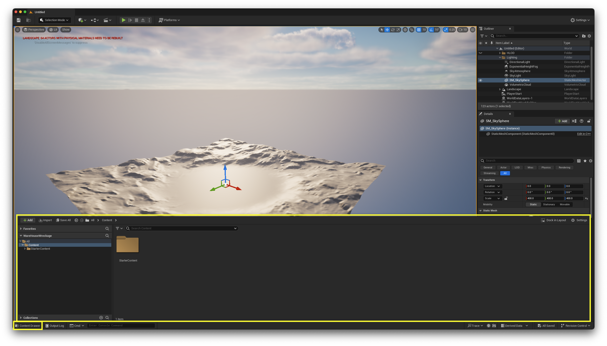
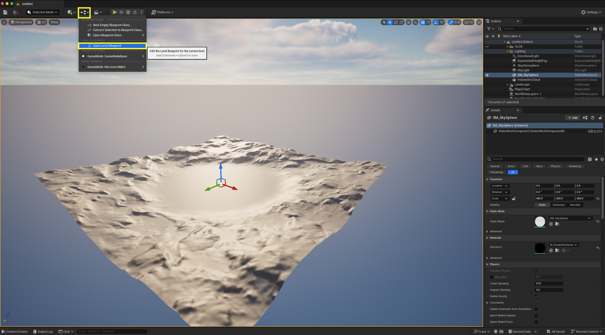

# Warehouse Wrekage

You can view the content of your project by pressing on **Content Drawer** button in the bottom left corner of the screen, this will open a drawer where you can explore all the content available in your project.

>[!NOTE]
> To speed up the movement while pressing on right mouse buttton to explore your scene, scroll up to increase the speed of movement and scroll down to decrease it.

To open up the Blueprint Editor, press on the button on the top menu bar that has 3 cubes connected with lines, then choose **Open Level Blueprint**.

