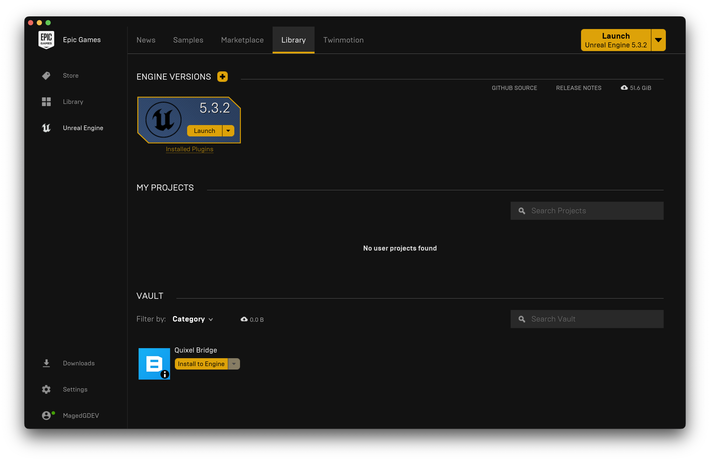
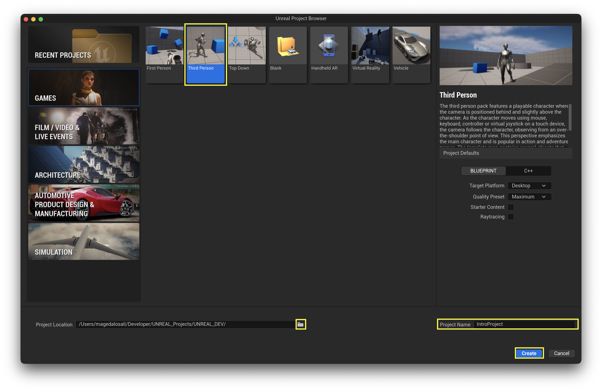
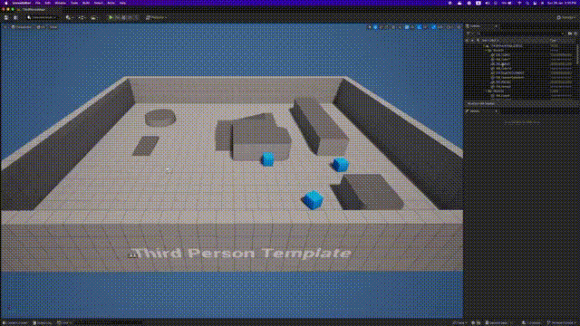
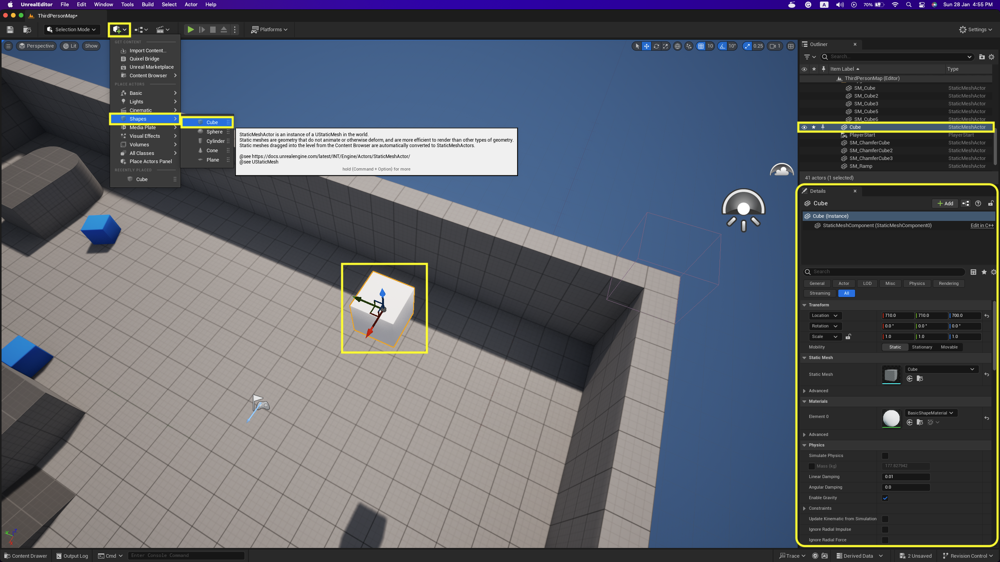
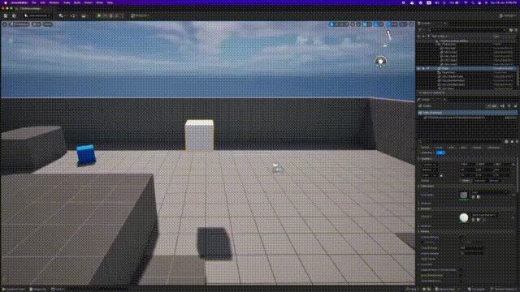

# Introduction to Unreal Engine

Unreal Engine is an engine used for several purposes, but mainly we will use it for game development. It is a very powerful engine that allows us to create games for several platforms, such as Windows, Linux, Mac, and more.

In this section, we will focus on learning the basics of Unreal Engine, such as the interface, how to create a project, and how to use the basic tools.

## Launching Unreal Engine

* Open the Epic Games Launcher.
* Click on the Unreal Engine tab.
* Click on the Library tab.
* Click on the Unreal Engine version you want to use.
* Click on the Launch button.

## Creating a project

* Click on the games tab.
* Click on the template you want to use, we will be using the ***`Third Person`*** template.
* Choose a project location by clicking on folder icon.
* Give your project a name, we will use ***`IntroProject`*** as the project name.
* Press on the create project button.

> [!TIP]
> The buttons and tabs that are mentioned above will be placed in a yellow box in the screenshots.

After creating the project, you will be greeted with the Unreal Engine interface, the view port and since we are using the ***`Third Person`*** template, we will be offered with some assets to use in our project to start with.

## Unreal Engine Interface Overview

Let's start by getting to know how to fire up the game and start playing it in the editor.

* Click on the **play** button in the top menu bar.
* Press on the game screen to start interacting with the game.
* To stop playing the game, click on the **escape** button on the keyboard.

if you didn't press on the game screen, you can stop playing the game by clicking on the **stop** button in the top menu bar or by pressing on the **escape** button on the keyboard.

To move around the editor scene, we have different options:

* Hold the **left mouse** button and move the mouse to rotate the camera, this gives us a 360 view of the scene and you can move around the scene by moving the mouse.
  * This option is called **orbiting**, it won't allow you to move the camera up or down.

* Hold the **right mouse** button and move the mouse to look around the scene, this will allow you to move the camera up and down, while holding the **right mouse** button, you can move around the scene by pressing on the **QWEASD** keys on the keyboard.
  * **Q** and **E** will move the camera up and down.
  * **W** and **S** will move the camera forward and backward.
  * **A** and **D** will move the camera left and right.

You can change the place of certain taps in the interface by dragging them around, for example, if you want to move the **World Outliner** tab to the bottom side of the screen, you can drag it from the top of the tab and drop it on the bottom side of the screen, and you can close a tab by clicking on the **x** button on the top right corner of the tab.

If you ever closed a tab by mistake, you can open it again by clicking on the **Window** tab in the top menu bar, then click on the tab you want to open, and you can also reset the layout of the interface by clicking on the **Window** tab in the top menu bar, then click on the **Load Layout** button, and choose the layout you want to use.

## Making a platformer

The view port shows us the scene we are working on, and each object in the scene is called an **actor**, and each actor has a **transform** that defines its location, rotation, and scale, by clicking on an object in the scene, we can see the following:

* The properties of the object in the **Details** tab.
* Arrow handles that allow us to move the object in the scene.

The **Outliner** tab is the textural representation of the scene, it shows us all the actors in the scene, and we can select an actor by clicking on it in the **Outliner** tab, and the **View Port** tab is the visual representation of the scene.

You can add a new actor to the scene by doing the following (we are going to add a cube to the scene):

* Click on the **Quickly Add to the Project** button in the top menu bar.
* Hover over the **Shapes** button.
* Click on the **Cube** button.
* The cube will be added to the scene and the **Outliner** tab, and the properties of the cube will be shown in the **Details** tab.

You edit the position, rotation, and scale of an actor by changing the values in the **Details** tab, or by dragging the arrow handles in the **View Port** tab.

> [!TIP]
> To get the arrow handles for an actor press on it and press on the **W** key on the keyboard, to move the actor, press on the **E** key on the keyboard to rotate the actor, and press on the **R** key on the keyboard to scale the actor or you can click on the **Translate**, **Rotate**, or **Scale** buttons in the top menu bar.

Now we can create a platformer game to escape the box the player is trapped inside.

